# 2. Parcours utilisateur et accessibilité de la plateforme

> Document généré le 18/07/2026 en rejouant réellement le parcours (compte
> créé, organisation créée, paiement Stripe en mode test effectué de bout en
> bout) sur un environnement local — voir [Portée et limites](#portée-et-limites-de-ce-document)
> avant diffusion. Aucune capture n'est une maquette : chaque écran ci-dessous
> est une capture d'écran brute de l'application réellement exécutée.

## Sommaire

- [Aperçu de la plateforme](#aperçu-de-la-plateforme)
- [Parcours client détaillé](#parcours-client-détaillé)
- [Solutions de paiement](#solutions-de-paiement)
- [Accès à la plateforme](#accès-à-la-plateforme)
- [Identifiants de test préconfigurés](#identifiants-de-test-préconfigurés)
- [Portée et limites de ce document](#portée-et-limites-de-ce-document)

## Aperçu de la plateforme

La plateforme est une **application web** (pas d'application mobile native) —
un starter SaaS multi-tenant : organisations, rôles/permissions, facturation
par abonnement, gestion documentaire, notifications, assistant IA.

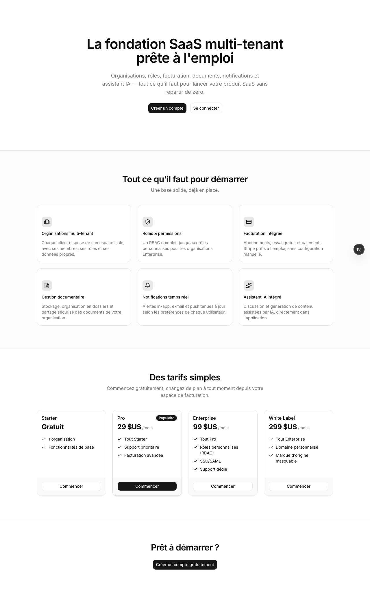

## Parcours client détaillé

Le parcours ci-dessous est celui d'un nouveau client, de l'arrivée sur la
plateforme jusqu'au paiement effectif d'un abonnement, rejoué avec un compte
et une carte de test réels (aucune étape sautée ni simulée en dehors de
l'écran).

### Étape 1 — Création de compte (`/register`)

Formulaire nom / e-mail / mot de passe (8 caractères minimum), validation
côté client avant soumission à l'API d'authentification (Better Auth).

| Formulaire vide | Formulaire rempli |
|---|---|
| 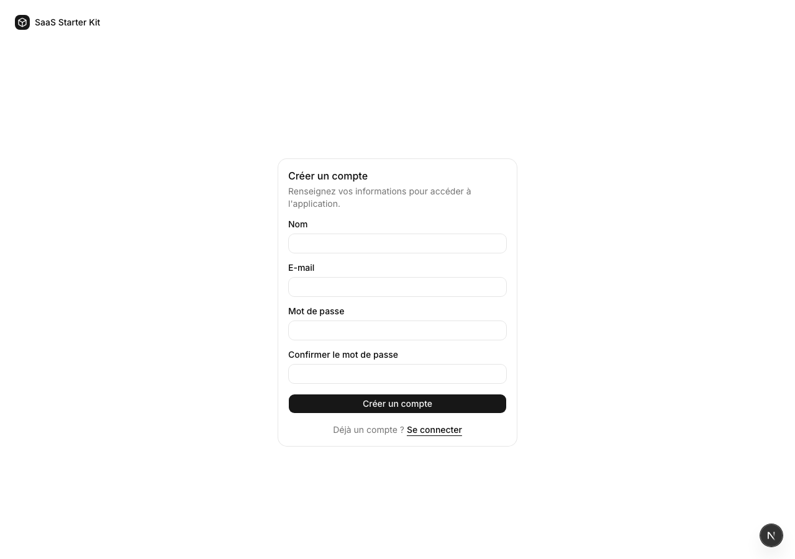 | 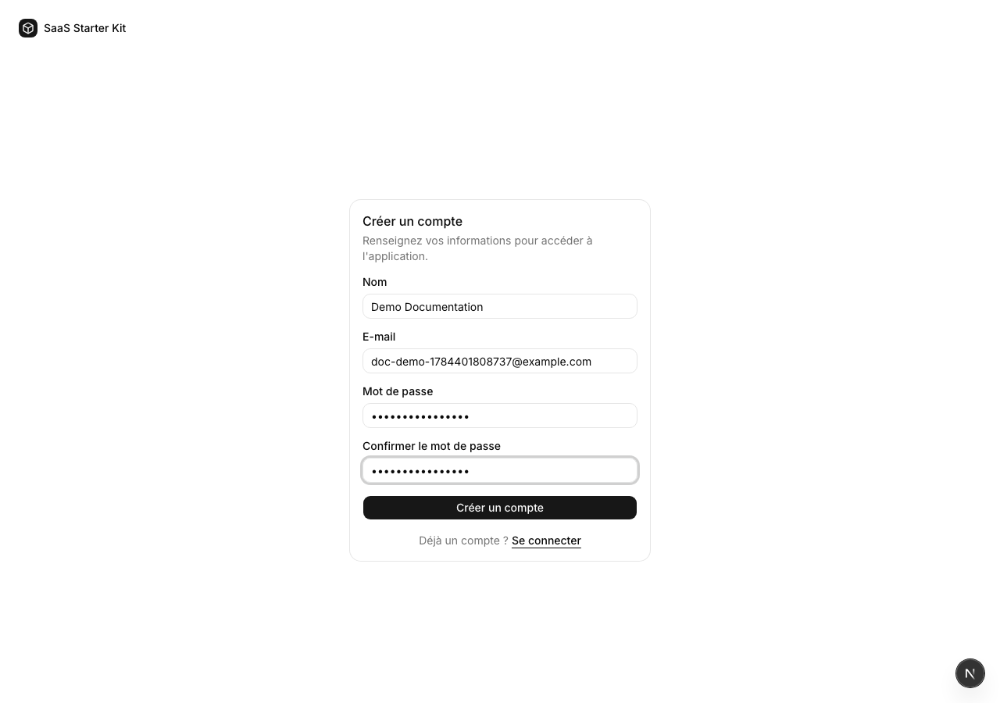 |

À la soumission, le compte est créé et l'utilisateur est redirigé vers
l'assistant d'inscription (`/onboarding`) — aucune organisation n'existe
encore à ce stade.

### Étape 2 — Assistant d'inscription : organisation (1/3)

Nom de l'organisation (le logo est optionnel, uploadé séparément après
création de l'organisation).

| Étape vide | Étape remplie |
|---|---|
| 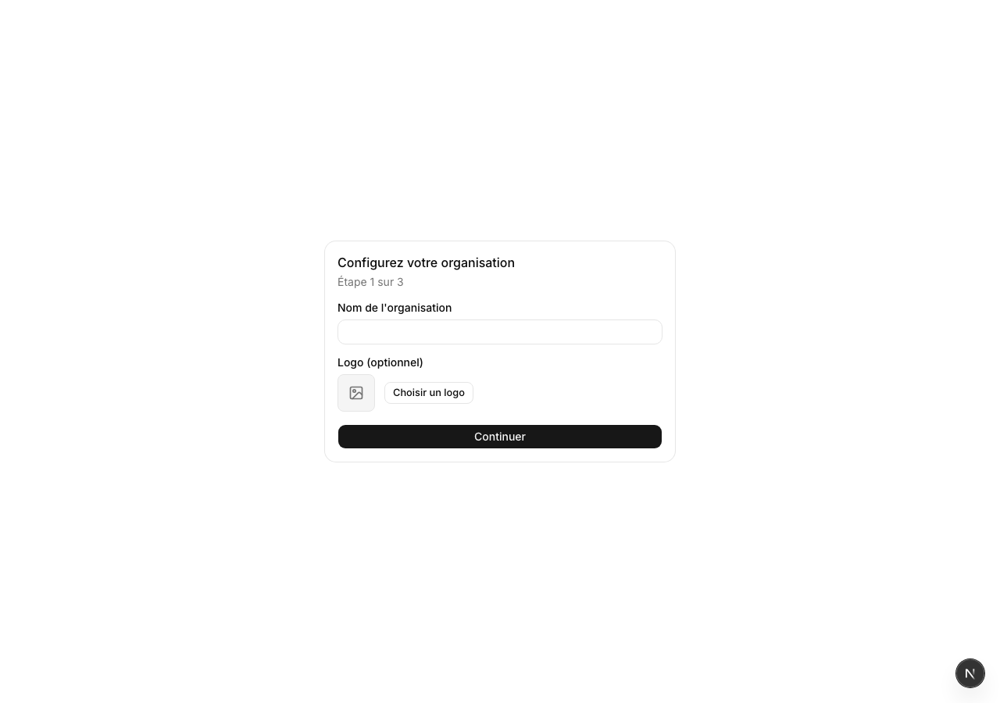 | 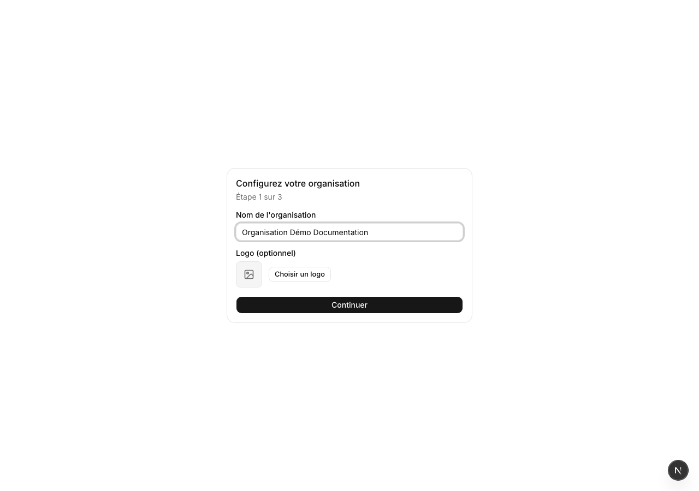 |

### Étape 3 — Assistant d'inscription : invitations (2/3, facultatif)

Invitation de coéquipiers par e-mail (jusqu'à 5), étape que le client peut
passer sans en saisir aucun.

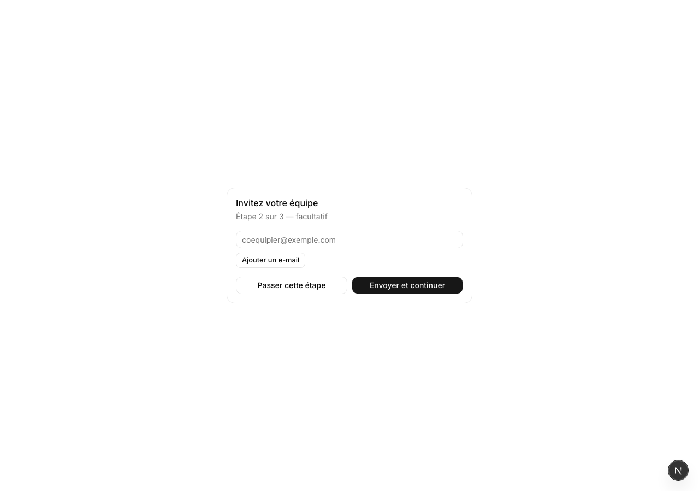

### Étape 4 — Assistant d'inscription : choix du plan (3/3)

Quatre plans actifs (Starter gratuit, Pro, Enterprise, White Label). Le
client peut soit souscrire immédiatement à un plan payant (redirection
Stripe Checkout), soit continuer avec l'essai gratuit de 14 jours déjà en
cours et souscrire plus tard depuis `/billing/plans`.

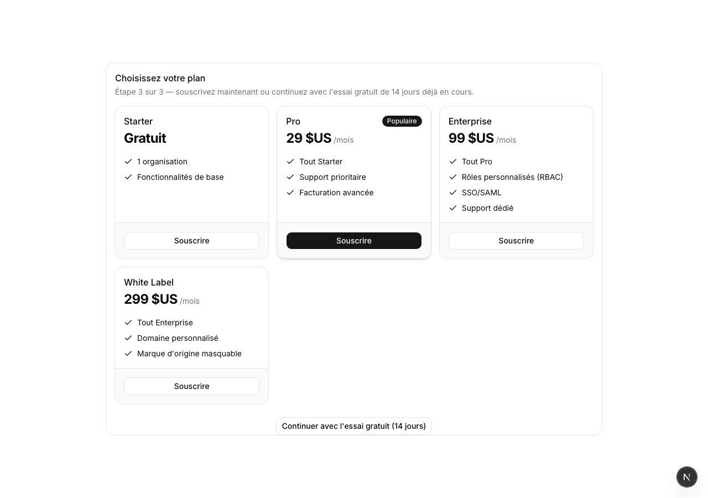

### Étape 5 — Paiement (Stripe Checkout hébergé)

Cliquer sur « Souscrire » (plan Pro dans cet exemple) appelle
`POST /api/billing/checkout`, qui crée une session Stripe Checkout et
redirige le navigateur vers une page **hébergée par Stripe** (pas de
formulaire de carte bancaire sur les serveurs de la plateforme — numéro de
carte, date d'expiration et CVC transitent directement vers Stripe).

| Page de paiement | Carte de test saisie |
|---|---|
| 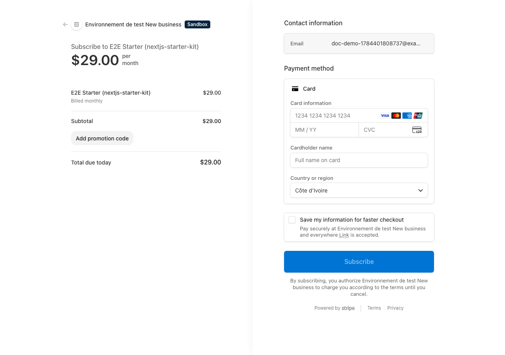 | 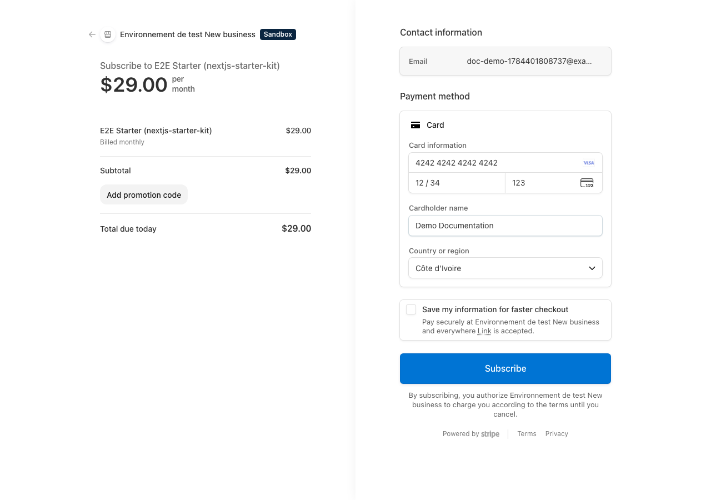 |

> Le bandeau « Sandbox » et le nom de produit affiché (« E2E Starter »)
> viennent de la configuration du compte Stripe de **test** utilisé pour cette
> capture — à renommer conformément au plan (« Pro ») dans le tableau de bord
> Stripe avant toute démonstration externe ou mise en production.

### Étape 6 — Retour sur la plateforme, abonnement actif

Après validation du paiement, Stripe redirige vers `/dashboard` avec
l'abonnement déjà actif. La page « Facturation » (`/billing`) confirme le
plan souscrit, le statut et la prochaine échéance ; le client peut aussi y
changer de plan, mettre à jour son moyen de paiement ou résilier
(auto-service via le portail client Stripe).

| Tableau de bord | Facturation |
|---|---|
| 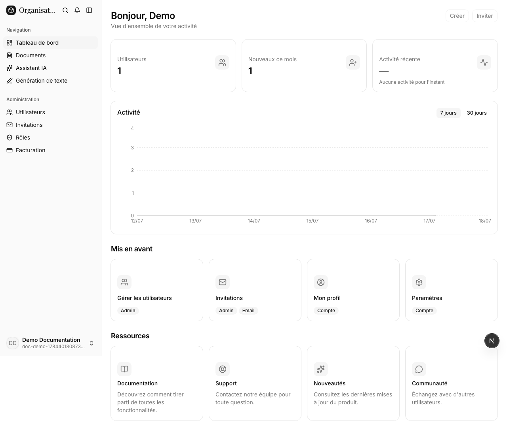 | 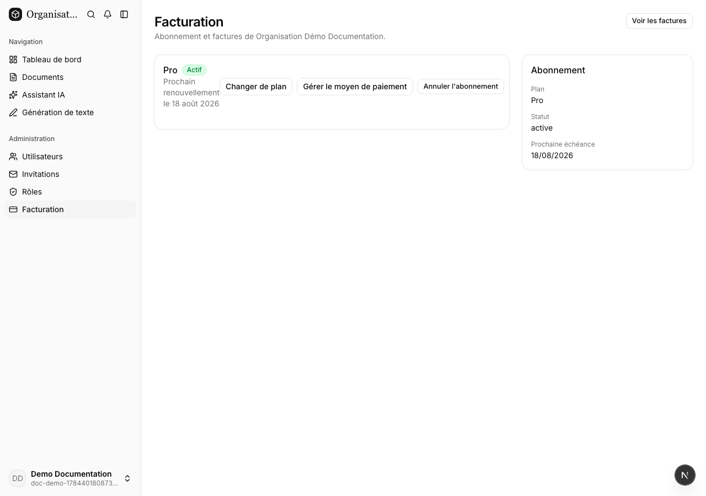 |

La page « Factures » (`/billing/invoices`) liste l'historique de facturation,
alimenté par le webhook Stripe (`checkout.session.completed` puis événements
de facturation ultérieurs) :

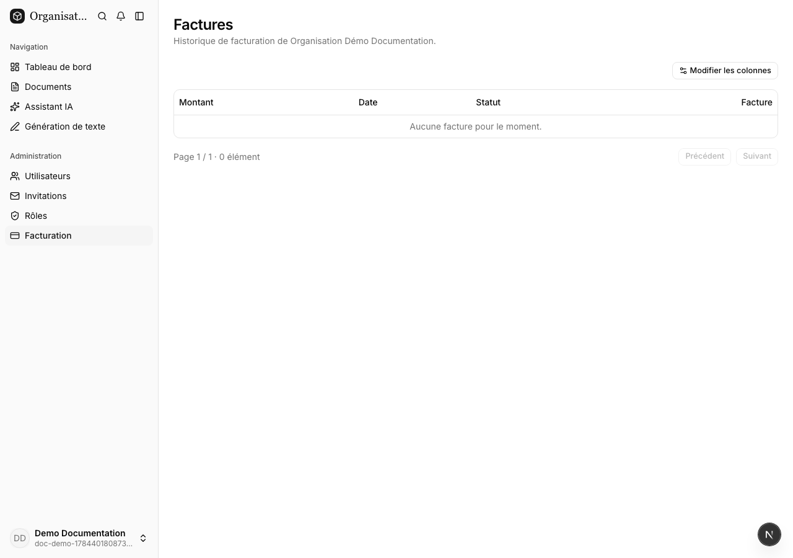

> Sur cette capture, aucune facture n'apparaît encore : l'écouteur de webhook
> Stripe (`stripe listen` en local, ou l'endpoint `/api/webhooks/stripe` en
> production) n'était pas actif pendant cette capture. L'abonnement, lui, est
> bien confirmé actif (visible sur la page Facturation ci-dessus) grâce au
> mécanisme de secours immédiat qui synchronise l'abonnement au retour de
> Stripe Checkout, indépendamment du webhook.

## Solutions de paiement

**Un seul moyen de paiement est intégré aujourd'hui : la carte bancaire, via
Stripe Checkout** (mode `subscription`, abonnements récurrents). Le
paiement est entièrement délégué à la page hébergée par Stripe — la
plateforme ne stocke ni ne traite elle-même de données de carte.

**Aucun portefeuille mobile (mobile money, Orange Money, Wave, MTN MoMo,
etc.) n'est intégré à ce jour.** Stripe Checkout propose par ailleurs des
moyens de paiement additionnels selon la configuration du compte Stripe et la
région (Apple Pay, Google Pay, Link, Amazon Pay sont visibles en option
« Express checkout » sur la page Stripe elle-même) — mais aucun de ces
moyens n'est un portefeuille mobile local, et leur activation dépend de la
configuration du compte Stripe utilisé, pas du code de la plateforme.

## Accès à la plateforme

**C'est une application web — il n'existe ni fichier APK, ni application
mobile native, ni fiche sur un store d'applications.**

- Environnement local utilisé pour produire ce document : `http://localhost:3000`
- Il n'existe pas, à ce jour, d'URL de production déployée pour cette
  plateforme — à compléter ici dès qu'un environnement de production ou de
  démonstration public existe (ex. `https://app.mondomaine.com`).

## Identifiants de test préconfigurés

Un script de seed (`pnpm db:seed`) crée systématiquement les comptes
suivants sur une base fraîchement migrée :

| Rôle | E-mail | Mot de passe |
|---|---|---|
| Owner (organisation de démo) | `owner@example.com` | `password123` |
| Super-admin | `superadmin@example.com` | `password123` |

Le compte utilisé pour produire les captures de ce document (créé via le
formulaire d'inscription, pas par le seed) :

| Rôle | E-mail | Mot de passe |
|---|---|---|
| Owner (« Organisation Démo Documentation ») | `doc-demo-1784401808737@example.com` | `TestPassword123!` |

**Carte de test utilisée pour le paiement Stripe** (carte de test standard
Stripe, ne débite jamais réellement) : `4242 4242 4242 4242`, expiration
`12/34`, CVC `123`.

> ⚠️ Ces identifiants ne fonctionnent que contre une base de données de
> **développement/test**. Le script de seed refuse explicitement de s'exécuter
> si `NODE_ENV=production`. Ne jamais réutiliser ces identifiants ou cette
> carte sur un environnement réel.

## Portée et limites de ce document

- Toutes les captures ont été prises en exécutant réellement l'application
  (`pnpm dev`) contre une base de données PostgreSQL locale fraîchement
  migrée et seedée, avec les vraies clés Stripe de **test** déjà présentes
  dans `.env` du projet — aucune capture n'est une maquette ou une image
  retouchée.
- Ce document décrit l'état du code à la date indiquée en en-tête. Il devra
  être régénéré (ou au minimum revu) après toute évolution du parcours
  d'inscription, de l'assistant d'onboarding ou de l'intégration de paiement.
- Ce document a été préparé à usage **interne/produit**. S'il doit être
  transmis à un tiers externe (régulateur, auditeur, partenaire), relire au
  minimum la section [Accès à la plateforme](#accès-à-la-plateforme) — il n'y
  a aujourd'hui ni URL de production ni application mobile à communiquer.
